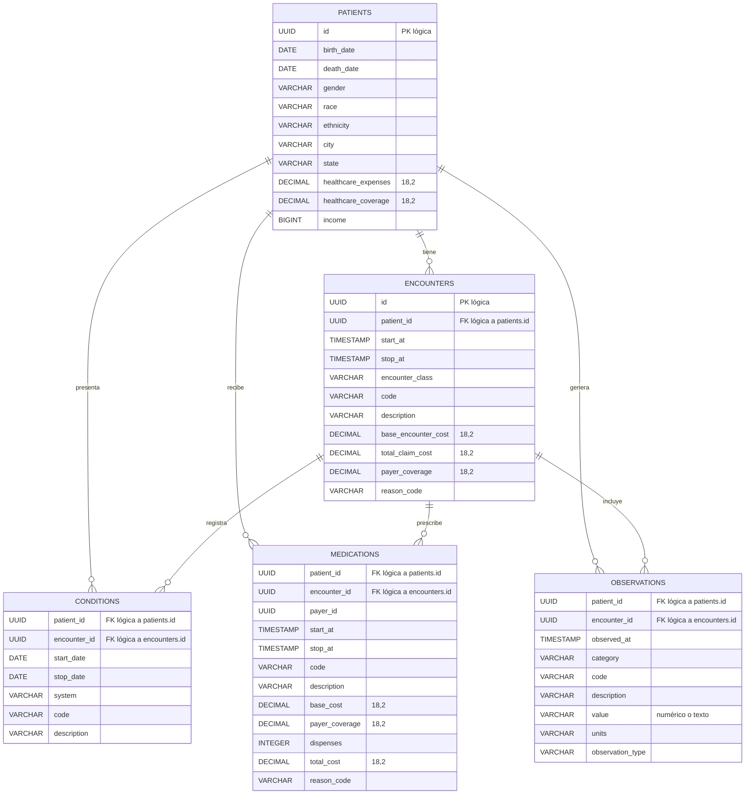

# Diagrama entidad-relación — Lab 10

Este diagrama representa las relaciones **lógicas** de los CSV de Synthea
cargados en DuckDB. Una barra doble junto a la entidad padre y el símbolo de
“cero o muchos” junto a la entidad hija expresan una relación lógica 1:N: un
paciente o encuentro puede no tener registros hijos o puede tener varios.

## Interpretación de claves

- `patients.id` y `encounters.id` son PK lógicas porque se verificó que no
  contienen duplicados.
- Los campos `patient_id` y `encounter_id` indicados arriba son FK lógicas por
  su significado en Synthea y por las relaciones establecidas para este lab.
- `conditions`, `medications` y `observations` no contienen un ID propio en los
  archivos fuente; no se les asigna una PK artificial.
- El diagrama no implica constraints físicos. En la base actual todas las
  columnas muestran `key=None` porque `carga.sql` no declara `PRIMARY KEY` ni
  `FOREIGN KEY`.
